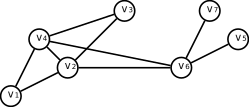
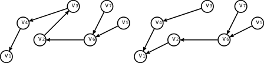
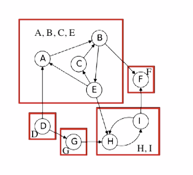
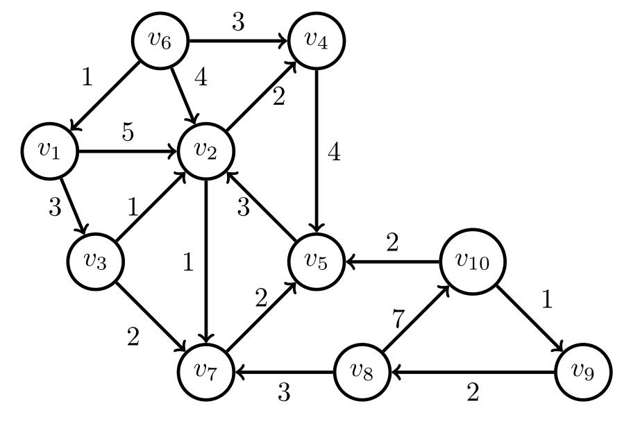
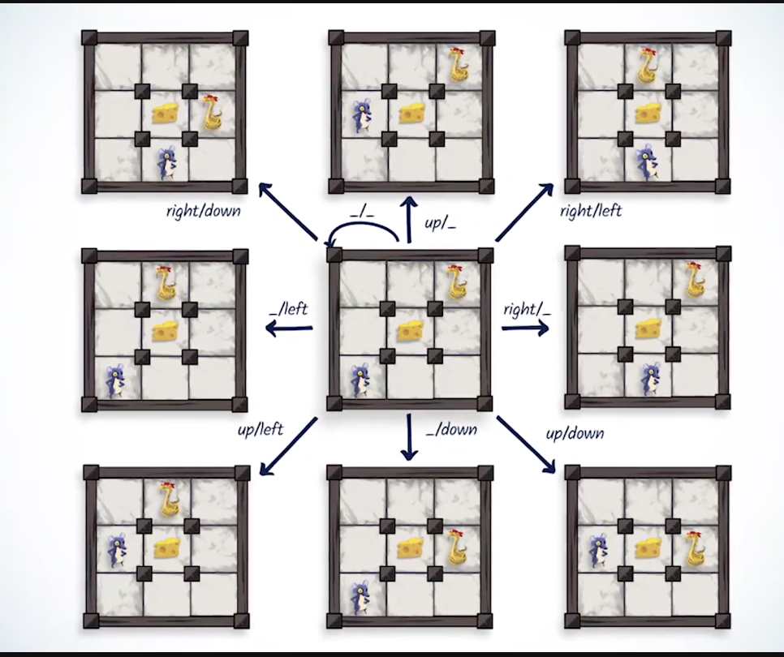

<style TYPE="text/css">
code.has-jax {font: inherit; font-size: 100%; background: inherit; border: inherit;}
</style>
<script type="text/x-mathjax-config">
MathJax.Hub.Config({
    tex2jax: {
        inlineMath: [['$','$'], ['\\(','\\)']],
        skipTags: ['script', 'noscript', 'style', 'textarea', 'pre'] // removed 'code' entry
    }
});
MathJax.Hub.Queue(function() {
    var all = MathJax.Hub.getAllJax(), i;
    for(i = 0; i < all.length; i += 1) {
        all[i].SourceElement().parentNode.className += ' has-jax';
    }
});
</script>
<script type="text/javascript" src="https://cdnjs.cloudflare.com/ajax/libs/mathjax/2.7.4/MathJax.js?config=TeX-AMS_HTML-full"></script>
Graph Theory and Algorithms (with Python)
---  
 [//]: # (Define NTBC = Need to be checked)
 # Content

- [Introduction](#intro)  
- [Main](#main) 
	1. [I. Definitions](#unit1)
	2. [II. ](#unit2)
	3. [III. ](#unit3)
	4. [IV. ](#unit4)
	5. [V. ](#unit5)
	6. [VI. ](#unit6)
- [Future Study](#future)

---
# Introduction 
Note-taker: [Baksi](https://github.com/BaksiLi)  
This is a summary note from NET04x (IMTx) [^1], ALGS202x and {NP-Complete Problems} (UCSanDiegoX) [^2]. The former provided most of the algorithmics knowledge, whereas the latter two courses supported the note with mathematical details.

There are six units in total, where each unit consists of a section of theory and a several sections of algorithms.

[^1]: [NET04x: Advanced Algorithmics and Graph Theory with Python](https://www.imt-atlantique.fr/fr/formation/moocs-et-cours-ouverts/moocs/advanced-algorithmics-and-graph-theory-python) at IMT wesite, or [Advanced Algorithmics and Graph Theory with Python] at EdX. 
[^2]: [ALGS202x: Graph Algorithms](https://www.edx.org/course/graph-algorithms-uc-san-diegox-algs202x). (UCSanDiegoX).

# Main [main]
## Unit 1: Definitions [unit1]
### 1.1 Basics of Graphs [maths1]
1. Graph is to represent connections between objects. For example, maps, social networks, configuration spaces (of robots).
1. DEF: An (undirected) **graph**, is a collection $V$ of *vertices* and a collection of $E$ *edges* each of which connects a pair of vertices, denoted $G=(V,E)$.
	- Analogy: Vertices are points; Edges are connecting lines.
1. Example:    
	Vertices: $\{v_1, v_2,\dots, v_7\}$<br>
	Edges: $\{(v_1,v_2),(v_1,v_4),\dots\}$
1. DEF: *Loop* connect a vertex to itself; *Multiple edges* are edges between same vertices. A simple graph do not involve them.
1. DEF: The *size* of a graph, $|G|$ is the number of edges. The size of a complete graph with an order $n$ is $n(n-1)/2$. The number of edges incident on a vertex is the *degree* of the vertex.

### 1.2 Storing a graph
1. *Edge list*: Store vertices and pairs of edges.
1. *Adjacency list*: Store each vertex with their adjacencies in a dictionary (Hash table).
1. *Adjacent Matrix* can be use to represent a graph, where 1 means connection. This allows us to assign weights to the graphs.
	- For Figure 1 above:

	| V  | v1 | v2 | v3 | v4 | v5 | v 6 | v7 |
	|----|----|:--:|----|----|----|-----|----|
	| v1 |    | 1  |    | 1  |    |     |    |
	| v2 | 1  |    | 1  | 1  |    | 1   |    |
	| v3 |    | 1  |    | 1  |    |     |    |
	| v4 | 1  | 1  | 1  |    |    | 1   |    |
	| v5 |    |    |    |    |    | 1   |    |
	| v6 |    | 1  |    | 1  | 1  |     | 1  |
	| v7 |    |    |    |    |    | 1   |    |
	
- Summary

	| ⃘            | Is Edge?      |    List Edges   | List No.s     |
	|-------------|---------------|:---------------:|---------------|
	| Edge List   | $\Theta(1)$   | $\Theta(|V|^2)$ | $\Theta(|V|)$   |
	| Adj. List   | $\Theta(|E|)$ | $\Theta(|E|)$   | $\Theta(|E|)$ |
	| Adj. Matric | $\Theta(deg)$ | $\Theta(|E|)$   | $\Theta(deg)$ |
	
To compare the complexities based on different parameters, we can look at the *graph density*. $|E|\approx|V|^2$ is a case of dense graph; $|E|\approx|V|$  is a case of sparse graph.

### Exercise
-  [PyRat maze game](https://github.com/vgripon/PyRat)

## Unit 2: Graph Traversal
Graph traversal explores the graph, one vertex at a time, between pairs of vertices in the graph, and obtains a list of all accessible vertices from a given initial vertex.

[//]: # (clearly state that sth is Minimum spanning tree problem)

### 2.1 Exploring graphs (continued [1.1](maths1)) [maths2]
1. DEF: A **path** in a graph $G$ is a sequence of vertices $v_1, v_2,\dots,v_n$ so that $\forall i$, $v_i, v_{i+1}$ are edges of $G$. (*walk* can overlap).
1. DEF: A  **cycle** in a graph $G$ is a sequence of vertices $v_1, v_2,\dots,v_n$ so that $(v_1,v_2),(v_2,v_3),\dots (v_{n-1},v_n),(v_n,v_1)$ are all edges.
1. DEF: A **tree** is a connected graph with no cycles. A **spanning tree** of a graph $G$ is a tree obtained from $G$ by removing edges.

	[//]: # (Find a **minimum spanning tree** in a complete graph, brute-force approach takes $n^{n-2}$)

1. DEF: **Routing** is the process to trace back from a destination to the root (origin). If we draw. 
	- Child and Parent

### 2.2 Graph Traversal
1. **Depth-first Search** (DFS): Follow a long path forward, only backtracking when met a dead end. This does not necessarily yield shortest paths. [Visualization](https://www.cs.usfca.edu/~galles/visualization/DFS.html).
1. Theorem: If all vertices start unvisited, Explore(v) marks as visited exactly the vertices reachable from v.
	- Explore(v), or DFS

		```
		visited(v) <- true:
			for (v, w) in E:
				if not visited:
					Explore(w)
		```
		
	- proof: The algorithm only explores the reachable from $v$; $w$ is not marked as visited unless explored. So if $w$ explored, all neighbours explored. Suppose we have a vertex $u$ that is reachable from $v$ by path, then $w$ will reach it.
	- $O(|V|+|E|)$
1. Theorem: The vertices of a graph $G$ can be partitioned into Connected Components so that $v$ is reachable from $w$ iff. they are in the same connected component.
	- proof: Need to show reachability is an equivalence relation (Namely: 1.  v is reachable from v; 2. if v reachable from w, w is reachable from v; 3. if v reachable from u, and w reachable from v, w reachable from u.)
	- 	Explore(v) modified with a counter

		```
		visited(v) <- true:
		CCnum(v) <- cc
		for (v, w) in E:
			if not visited:
				Explore(w)
		```
		
	- Still $O(|V|+|E|)$
1. We can add Previsit and Postvisit orderings to the algorithm, which tell us about the execution of DFS. Lemma: For any vertices $u$, $v$ the intervals [pre(u), post(u)] and [pre(v), post(v)] are either nested or disjoint.

	```
	visited(v) <- true:
	previsit(v)
	for (v, w) in E:
		if not visited:
			Explore(w)
	postvisit(v)
	```

1. **Breadth-first Search** (BFS): Look at 1 hop vertices, 2 hop vertices... If the graph is unweighted, the spanning tree would alway provide the shortest path.

### 2.3 Storing graph traversals
- Stack: LIFO (Last in First out), DFS – last element being pushed to the structure would be the first being poped:

	``` python3
	LIFO_list = list()
	def LIFO_push(LIFO_list, x):
		LIFO_list.append(x)  # add x to the end
	def LIFO_pop(LIFO_list):
		return LIFO_list.pop(-1)  # return the value removed if needed
	```

- Queue: FIFO (First in First out), BFS – ...
- An unified algorithm for graph traversal in Python:

<details>

``` python3
def traversal(start_vertex, graph):
	queuing_structure = new_queuing_structure()
	queuing_structure.push(start_vertex, NULL))  # NULL is the parent of the starting vertex
	vertices_explored = []
	rounting_table = {}
	while queing_structure is not empty:
		(current_vertex, parent) = queuing_structure.pop()
		if not (current_vertex in explored_vertices):
			explored_vertices.push(current_vertex) 
			routing_table[current_vertex] = parent
			# Examine neighbors of the current vertex
			for neighbor in neighbors(graph, current_vertex):
				# We push all unexplored neighbors to the queue
				if neighbor not in explored_vertices:              
					queuing_structure.push(neighbor, current_vertex) 
		return vertices_explored, routing_table
```

</details>
Individual implementations could be found [traversal.py](Resources/traversal.py) in the Resources.
	
### Exercise
- Imagine we run a DFS (respectively a BFS) from any vertex of a complete graph of order . How many vertices are neighbors of  in the resulting tree?
	> $1$ and $n-1$
- Imagine a graph where $u$ and $v$ are vertices, and there is no path for which $u$ and $v$ are extremities. If we run a DFS from , which of the following propositions are true?
	> At the end of the DFS,  $v$ has not been explored. 

## Unit 3: Direction and Connectivity
### 3.1 Directed graph (continued [2.1](maths2)) [maths3]
1. DEF: A **directed graph** is a graph where each edge has a start vertex and an end vertex.   
	Things related but not symmetrically. E.g. One-way roads, Links between webpages, Followers on social network. We can sometimes to order vertices linearly.
1. DEF: In **linear ordering**, a **source** is a vertex with no incoming edges, and a **sink** is a vertex with no outgoing edges.   
1. Theorem: If $G$ contains a cycle, it cannot be linearly ordered.
	- proof: Suppose graph $G$ has a cycle $v_1,\dots,v_n$; then we assume that the graph could be linearly ordered. Let $v_k$ be a vertex in the cycle, then $v_k$ comes before $v_{k-1}$ which is a contradiction. Q.E.D.
1. DEF: A directed graph $G$ is a **Directed Acyclic Graph (DAG)** is it has no cycles.
1. Theorem: Any DAG can be linearly ordered.
	- proof: later.

### 3.2 Topological Sort
- Linear Ordering Algorithm
	- The general idea to produce a linear ordering is by removing sinks from the graph and ordering them with reversely until a source is met. But this would require us to know whether there *is* a sink in the graph. 
	- The check could be done by following a path: if vertex repeats, it means that the graph has a cycle, then ther is no sink; otherwise (deadend met) there is a sink.
	- We get an algorithm $LinearOrder(G)$:
		
	<details>
		
	```
	while G non-empty:
		Follow a path until cannot extend
		Find sink v
		Put v at end of order
		Remove v from G
	```
		
	Runtime: to compute one path for each vertex in the graph ($O(|V|)$) and for each vetex it taks $O(|V|)$ time. So the in overall $O(|V|^{2})$.
	</details>
	
- **Topological Sort**:
	- Instead of by retracing the entire path everytime when a sink is found, we could back off one step to save time. This is de facto just BFS!
	- We get a better algorithm $TopologicalSort(G)$:

	<details>
	
	```
	DFS(G)
	sort vertices by reverse post-order
	```
	
	Runtime: 
	</details>
	- Cf. [Topological Sort (DFS)](https://www.cs.usfca.edu/~galles/visualization/TopoSortDFS.html) Visualization.

1. Theorem: If $G$ is a DAG, with an edge $u$ to $v$, $post(u)>post(v)$.
	- proof: 
		- Consider cases: (i) explore $v$ before exploring $u$, (ii) explore $v$ while exploring $u$, and (iii) explore $v$ after exploring $u$.
		- (i) If explore $v$ before $u$, $u$ is not reachable from $v$ (DAG). Therefore $v$ must be explored before find $u$, as $post(u)>post(v)$.
		- (ii) If explore $v$ while exploring $u$, this means that explore of $v$ is a subroutine of exploring $u$. Therefore it finishes first.
		- (iii) cannot happen since there is an edge from $u$ to $v$.

### 3.3 Strongly Connected Components (continued [3.1](maths3)) [maths4]
1. DEF: **Diagraph** is where vertices are connected by couplers, such that $(u,v)\neq(v,u)\text{ if }u\neq v$.
1. DEF: Two vertices $v$, $w$ in a directed graph are **connected** if $\{v,w\}$ and $\{w,v\}$ exists.
1. Theorem: A directed graph can be partitioned into **strongly connected components** where two vertices are connected iff. they are in the same component.
	- proof: Similar from showing it in the undirected case. The equivalence relation.
1. A **metagraph** shows how the strongly connected components connect to one another.    
1. Theorem: The metagraph of any graph is always a **DAG**.
	- proof: Suppose it is not, then there is a cycle $C$, which means that any nodes in cycle can reach any others. But if they are all connected, they should be in one strongly connected component, which leands to contradiction.

### 3.4 Computing Strongly Connected Components Problem
- Given a directed connected graph $G$, find the stongly connected components.
- Easy Algorithm $EasySCC(G)$:

<details>

```
for each vertex v:
	run explore(v) to determine vertices reachable from v
for each vertex v:
	find the u reachable from v that can also reach v
thses are the SCCs
```
Runtime: $O(|V|^{2}+|V||E|)$.

</details>

- A faster idea: if $v$ is in a sink SCC, $explore(v)$ finds vertices reachable from $v$, which is exactly the SCC of $v$.
- Theorem: If $C$ and $C\prime$ are two strongly connected components with an edge from some vertex of $C$ to some vertex of $C\prime$, them largest post in $C$ is bigger than largest post in $C\prime$.
	- proof: Two cases: (i) visit $C$ before visit $C\prime$, and (ii) visit $C\prime$ before visit $C$.
		- (i) If $C$ is visited firstly, then we can reach everything from $C\prime$ from $C$. This means that while you're still exploring the first vertex in $C$, you actually explore everything else in $C$ and $C\prime$ as a subroutine. 
		- (ii) If $C\prime$ is visited firstly, then we cannot reach $C$ from $C\prime$. And since that we must finish explore $C\prime$, therefore ...
		
- Faster algorithm $SCCs(G)$:

<details>

```
run DFS(GR)  # reversed G
let v have the largest post number
run Explore(v)
vertices found are first SCC
Remove from G and repeat
```
Runtime:

</details>

- Fasterer algorithm:

<details>

```
run DFS(GR)  # reversed G
for v in V in reverse postorder:
	if not visited(v):
		Explore(v)
		mark visited vertices as new SCC
```
Runtime: Essentially just DFS on GR and then on G. So $O(|V|+|E|)$

</details>
- Cf. [Connected Components](https://www.cs.usfca.edu/~galles/visualization/ConnectedComponent.html) Visualization.


## Unit 4: Shortest Path Problem
BFS finds the shortest path in an unweighted graph. However, when a graph is weighted, BFS will not necessarily produce a shortest path. We therefore need a new algorithm.

### 4.1 Dijkstra's Algorithm (non-negative weighted graphs)
It is an algorithm that is guaranteed to output the shortest paths from an initial vertex when input graph weights are non-negative.


<details>
<summary>Scheme</summary>
- Initialize as the following:
<center>$\begin{array}{c|c|c|c|c|c|c|c|c|c|c}vertex& v_1 &v_2 & v_3 & v_4 & v_5 & v_6 & v_7 & v_8 & v_9 & v_{10}\\\hline explored & No & No & No & No & No & No & No & No & No & No\\ \hline distance & 0 & +\infty & +\infty&+\infty&+\infty&+\infty&+\infty&+\infty&+\infty&+\infty\end{array}$</center>
- Add vertices as keys and distances with regard to the starting position as the values.
<center>$\begin{array}{c|c|c|c|c|c|c|c|c|c|c}vertex& v_1 &v_2 & v_3 & v_4 & v_5 & v_6 & v_7 & v_8 & v_9 & v_{10}\\\hline explored & Yes & No & No & No & No & No & No & No & No & No\\ \hline distance & 0 & 5 & 3&+\infty&+\infty&+\infty&+\infty&+\infty&+\infty&+\infty\end{array}$</center>
- Continue from $v_3$ (which has the shortest distance). We see that path $\{v_1, v_3, v_2\}$ is shorter (in distance) than path $\{v_1, v_2\}$, so it is updated:
<center>$\begin{array}{c|c|c|c|c|c|c|c|c|c|c}vertex& v_1 &v_2 & v_3 & v_4 & v_5 & v_6 & v_7 & v_8 & v_9 & v_{10}\\\hline explored & Yes & No & Yes & No & No & No & No & No & No & No\\ \hline distance & 0 & 4 & 3&+\infty&+\infty&+\infty&5&+\infty&+\infty&+\infty\end{array}$</center>
- Et.C.
</details>
- Cf. [Dijkstra Shortest Path](https://www.cs.usfca.edu/~galles/visualization/Dijkstra.html) Visualization.

### 4.2 Min Heap Structure
- Min Heap structure: 
	- Python module *heapq*.
	- Elements are stored as (key, value), whereas value is from an ordered set. There are two operations:
		1. Add-or-replace: given a new element (k, v). If k already exists in the heap, then by comparing v, the one with the less v (shorter distance) is remained.
		1. Remove
	- An implementation:
		<details>
	
		``` python3
		def heap_add_or_replace(heap, triplet):
		    v, w, p = triplet
		    done = False
		    for i in heap:  # for every triplet in the existing heap
		        (v0, w0, p0) = i
		        if v0 == v:  # same key
		            done = True
		            if w < w0:  # if triplet is of smaller value
		                heap.remove(i)
		                heap.append(triplet)
		                break
		    if not done:  # either empty heap or no matched key
		        heap.append(triplet)
		        
		    # heap.sort(key=lambda x: x[1])
		```
		
		</detaisl>
	- See [Min Heap](https://www.cs.usfca.edu/~galles/visualization/Heap.html) visualization.

- Complexity: $O(E\log(V))$. Since the worst case means a complete graph => $E=\frac{V(V-1)}{2}\cong V^2$ and $E\gg V$. With adjacency list, $O((V+E)\log(V))=O(E\log(V))$. Q.E.D.

### 4.3 Bellman-Ford Algorithm
This section is in the status `to be added` since it is not included in the course content. A reference [Bellman-Ford Algorithm](http://mathworld.wolfram.com/Bellman-FordAlgorithm.html).

## Unit 4: Backtracking and Travelling Salesperson Problem
### NP-Completeness
.](Resources/PNPs.svg)

- The complexity theory classifies problems based on their difficulties to solve.
	- **P** (Polynomial time) problems are solved (deterministically) by algorithms that takes steps bounded by some power of the problem's size. These problems includes shortest path problem, which is solved by Dijkstra and BFS ($O(E\log{V})$ and $O(V+E)$ rerspectively).
	- **NP** (Nondeterministic Polynomial) problems are those whose solution is verifiable in polynomial time. Therefore if a solution of a NP-problem is known, "then demonstrating the correctness of the solution can always be reduced to a single P verification." P-problem class is a subset of NP-problems.   
		<sub>Another definition, solvable in polynomial time by a undeterministic Turing machine.</sub>
	- **NP-hard**  problems could be translated into one for solving any NP problem, i.e. at least as hard as NP-problems.
	- **NP-complete** problems are both NP and NP-hard. 
- Reduction:  transforming one problem into another problem, typically for which solutions are already known. (Intuitively) $p\leqslant q$ indicates that $p$ is reducible from $q$, so it is solvable by the algorithm of $q$.

[//]: # (http://discrete.gr/complexity/ as a reference)

### Travelling Salesperson Problem (TSP)
- To find the shortest route going through all vertices of a weighted graph from an initial vertex. 
- A typical **NP-hard** problem (proved) in **combinatorial optimisation**.
- The problem is represented by a weighted graph with vertices as cities and weights on the edges as travel costs. The aim is to find the path which has the minimum cost, *i.e.* the optimal solution. 
- *E.g.* Transportation and logistics (to find the shortest path), Routing an artificial satelite (to reduce the cost in journy), Optical fibre network *etc*.
- meta-graph

### Brute Force Search
- Brute Force Search is one of the exact algorithm which solves TSP. It tries all permutations and conclude the shortest, as called an *exhaustive* approach. 
- Therefore if the size of the graph is fixed, permutation equals $(n-1)!$; therefore the algorithm is $O(n!)$ polynomial. It is therefore lack of scalability.
- An implementation in Python:
<details>

	``` python3
	best = 999  # infinity
	def bruteforce(remaining, vertex, path, weight, graph):
	  if remaining is empty:
	    if weight < best:
	      best = weight
	      best_path = path
	  else:
	    for each vertex i in remaining:
	      bruteforce(remaining - i, i, path + i, weight + graph[vertex][i],graph)
	      
	 bruteforce(vertexes_List - starting_vertex, starting_vertex, empty_list, 0, graph)
	```

</details>
### Improve with Bracktracking
iteratively examines the lengths of routes and immediately aborts examination of a route that is longer than the shortest found so far. exploration of the current branch is aborted if the length of the partial route is greater than the best route found so far. In the best case, only the first branch has been fully explored.
- True statements about TSP
	- On a weighted graph in which all weights are equal, backtracking will be at least as costly as a bruteforce search.
	- The order in which vertices are explored has an important influence on overall execution time.

## Unit 5 Heuristics, Greedy approaches
- Heuristic, produce a solution that's faster to solve problem in hand. For example, if we know the direction of the destination, we can design the heuristic that move only in the direction, although this may be worse. A good heuristic provides a gain and is of the limited complexity.
- Greedy Approach: The purpose of a greedy algorithm is to approximate the solution to a problem by a succession of locally optimal solutions. In TSP, we always choose to go for the edge with the shortest distance until reached the destination, which results in $O(|V|^{2})$.
- An example in which greedy algorithm is optimal. 
> Consider the problem of returning coins after a payment. We wish to return a certain amount of change in euros, and we've got the following pieces: 1c, 2c, 5c, 10c, 20c, 50c, 1€, 2€. The aim is to use as few coins as possible.

but this when the condition slightly changed:
> Now let us consider the following pieces: 1c, 2c, 5c, 10c, 20c, 40c, 50c, 1€, and in this case we want to return 80c. The greedy algorithm will return 50c (30c left), then 20c (10c left) and 10c, i.e., three pieces. However, returning 80c can also be done by returning two 40-cent pieces.

- Pareto front delimits trade-offs between complexity and correctness; Pareto optimal.

## Unit 6 Application: Combinatorial Game Theory
- In computer science, game theory is widely applied. For example, in operating systems where the goal of the game is to prevent errors.
- Consider in a maze, where two players move (simutaneously) to find the treasures in some positions, with the one who finds the most treasures firstly being the winner of the game.
- The above game can be formalized by a specific graph called *arena*, where each vertex summarizes the state of the game (positions of the players and the treasures) and edges corresponds to how plays evolve. So a play can be seen as a walk in the arena, whereas a strategy is a function that associates a vertex in the arena with decisions.

- A *winning strategy* for the senario is the strategy that leads a player to victory. Since a maze is symmetrical, if both players choose to move by the symmetry, then the game will end up in a tie; else if a play at some point breaks the symmetry, the game will admit winning strategies subsequently. And we are to determine whether such a strategy exists throughout the game, by considering two interwined combinatorial factors – the moves of each players – which is a huge graph (we will at least have $(2\times 2)^{N}$, where $N$ is the number of turns), therfore we have to reduce the game.
- Compute winning strategy by *dynamic programming*. Consider the senario:
> 15*11 cells' maze -> 165 cells in total;
7 treasures to find -> $2^{7}$ possibe states of the treasures;
scores to win is 5 -> scores range $[0,4]$.

so the maximum size of the arena is $2^{7} * 165^{2} * 5 \approx 10^{6}$. We then identify vertices in the arena for winning.

---
# Further Study
- [NP-Complete Problems](https://www.edx.org/course/np-complete-problems-uc-san-diegox-algs203x) provided by UCSanDiegoX goes deeper in theoretical computation.
-  [Graph Algorithms in Genome Sequencing](https://www.edx.org/course/graph-algorithms-genome-sequencing-uc-san-diegox-algs206x) provided by UCSanDiegoX. 