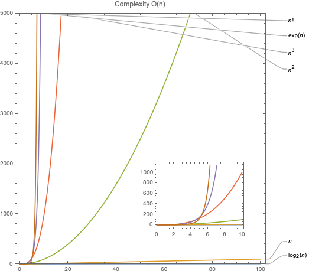
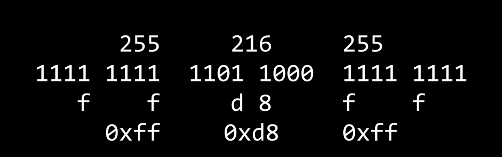
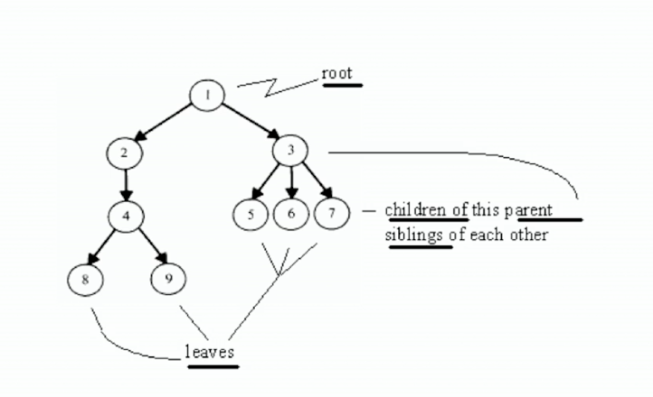
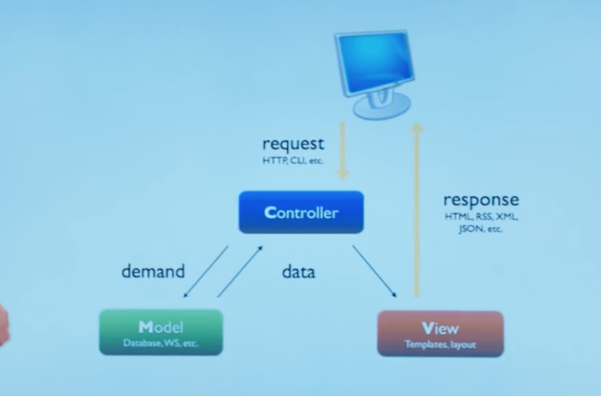

<script type="text/javascript" src="http://cdn.mathjax.org/mathjax/latest/MathJax.js?config=TeX-AMS-MML_HTMLorMML"></script>
Introduction to Computer Science  
---  
Note-taker: [Baksi](https://github.com/BaksiLi)  

# Content

- [Introduction](#intro)  
- [Main](#main)    
	1. [Programming](#i-programming)
		1. Scratch
		1. Program?
		1. Computer Science?
	1. [C Language Basics](#ii-c-language-basics)
		1. Environments
		1. C Language
		1. Array
	1. [Computing](#iii-computing)
		1. Addressing Computational Problems
		1. Algorithm?
		1. Computational Complexity
	1. [Basic Algorithms](#iv-basic-algorithms)
		1. Search Algorithms
		1. Sort Algorithms
		1. Others <!-- Light-ups -->
	1. [Memory](w4)
		1. RAM ...
	1. [Data Structures](w5)
		1. Node ...
	1. [Web and Internet](w6)
	1. [Python](w8)
	1. [SQL](w9)
	1. [JavaScript](w10)
- [Future Study](#future)

---
# Introduction
This is a short but tangible introduction of computer science, mostly based on the note of CS50x 2017 of Harvard University, lectured by <a mailto="malan@havard.edu">David J. Malan</a>.
The content and structure may be different from the [official syllables](http://docs.cs50.net/2017/x/syllabus.html) since it has been restructured and modified with new materials, esp. the theoretical parts. Meanwhile, parts teaching how to code were reduced for the sake of simplicity. Nevertheless, all the knowledge are covered and extended beyond their scope. 
The original course video and other supporting materials could be found in the [seminar page](http://cs50.tv/2017/fall/#about,lectures), or in their channel [cs50 live](https://www.youtube.com/user/cs50tv/).
 
# Main
## I. Programming
<!-- Originally week 0 -->
### Scratch
 [Scratch](www.scratch.mit.edu) is a visual toolkit for amateurs to learn and grab an idea of *programming*. 
### How program works?  
- **Computers** are information processing automata; they are dumb machines in the sense that they do *only* what user instructed, but at the same time very clever if the people behind are intelligent.
- A computer **program** is a collection of instructions to achieve specific tasks. It is a liminal artefact, since instructions are abstract but the operations are done in the physical world. **Binaries** corresponded directly to specific instructions. 
- **Assembly Language** enabled the programmers to use symbolics instead of binaries, released them from clerical workload, a symbolic assembler is used in such translations. It is just symbol-to-operation therefore low-level and not portable.
- **Higher-level Language**s are designed, to abstract from features of the actual physical machines, among them *FORTRAN* (FORmula TRANslation Language) is the first. They requires a class of programs called **compilers** for translating  statements into sequence of machine codes (instructions) that can be directly executed. 
	- A good short-piece discussion of programming languages, see [Blue. No! Yellow!](https://blog.cleancoder.com/uncle-bob/2016/05/21/BlueNoYellow.html).
- Tasks are approached by **Algorithms**.  
- **Operating System** channeled all input and output (i.e. I/O) operations.
### Computer Science?
- Computational artefacts are *made*  things which entail the purpose of their creators. **Computer science** is the science of such artefacts.
- Therefore often material computational artefacts, or computer hardwares, belong to the domain of engineering schools, while liminal and abstract ones are in the domain of school of science.
### Relevant readings at the stage
- *How Computers Work*, Tenth Edition
Ron White
Que Publishing, 2014
ISBN 0-7897-4984-X
- *Code: The Hidden Language of Computer Hardware and Software*, First Edition
Charles Petzold
Microsoft Press, 2000
ISBN 0-735-61131-9
- *Programming in C*, Fourth Edition
Stephen G. Kochan
Pearson Education, 2015
ISBN 0-321-77641-0
- *Hacker’s Delight*, Second Edition
Henry S. Warren Jr.
Pearson Education, 2013
ISBN 0-321-84268-5

## II. C Language Basics
<!-- Originally week 1 -->
### Environment
#### CS50 IDE
- Environment: Cloud [IDE](https://ide.cs50.io/) platform, [CS50.h Reference](https://reference.cs50.net/math/modf). The library is available at GitHub, *cf.* [libcs50](https://github.com/cs50/libcs50).
- Debugging in IDE: `eprintf`, ` help50` and `debug50`.
#### In situ
- Editors: [Vim](https://en.wikipedia.org/wiki/Vim_(text_editor)) or [Eclipse](https://en.wikipedia.org/wiki/Eclipse_(software)) for Hardcore players. The presenter uses [Atom](https://atom.io/).
- IDEs are good and easy to install. 
	- C: MacOS users can (sometimes must) install [Xcode](https://developer.apple.com/xcode/); for cross-platform [Visual Studio Code](https://code.visualstudio.com/).
	- Python: [Anaconda](https://www.anaconda.com/distribution/) (with its Spyder) is the default choice for data scientists, while [PyCharm](https://www.jetbrains.com/pycharm/) is more compatible with other uses. However, in early 2019 Anaconda and JetBrains announced that they will [join forces to launch 'PyCharm for Anaconda'](https://www.businesswire.com/news/home/20190404005205/en/Anaconda-JetBrains-Join-Forces-Launch-%E2%80%98PyCharm-Anaconda%E2%80%99), so no more troubles in the future.
### C language
- Introduction to *C* language and basic *Bash* instructions
- Good coding style is important. [CS50 style guide of C](https://manual.cs50.net/style)
### Array
- String: it turns out that underneath the hood, strings are a little more mundane - **grid of information**, sometimes known as bucket. Lee takes those contiguous block of memory "- L - e - e - \0 -" in RAM.  
	`int main(int argc, string argv[])`  

### [Problem set #1](https://docs.cs50.net/2017/x/psets/1/pset1.html)
- Hello World  
- Functions  
- IO & Loop  
### [Problem set #2](https://docs.cs50.net/2017/x/psets/2/pset2.html)
- Caesar Cipher
- Vigenere Cipher
- [Crack Cytology question](https://docs.cs50.net/problems/crack/crack.html)

<!-- III. Arrays, Originally week 2, is moved to II-->

## III. Computing
<!-- Originally week 3 -->
<!-- This chapter is modified according to Subrata Dasgupta's *Computer Science* -->
## Addressing Computational Problems
- To address a computational problem:
	- Formulation:  Express the problem formally
	- Specification: Find the **algorithm** to deploy
	- Implementation: Coding

### Algorithm?
- **Algorithms** are abstract artefacts of the method for solving problems. They are designed to meet the goals or needs of its performer, and embodies non-declarative procedures or *procedural knowledge* (objective knowledge as Karl Popper called).
	- In chemistry, litmus test is a decision procedure which decides the acidity (or alkalinity) of substance, *if* blue *then* alkaline; *if* red, acid; *otherwise* it is neutral. Examples in maths: long division algorithm for factorization.
	- "In computing practice the algorithm denotes the expression on paper of the proposed computational process (often by means of a flowchart) prior to the preparation of the program. If no algorithms is possible a heuristic solution has to be sought {in which it involves trial and error, as in iteration.}."
	- In such procedure, the experimenter does not necessarily need to know why it works:- the execution is mindless thinking. It is comforting that the performance of an algorithm is not dependent of the performer.
- More generally, as enunciated by Donald Knuth, in order to procedure the following attributes must be satisfied:
	1. Finiteness: An algorithm always terminates after a finite number of steps (or satisfied a certain termination criterion).
	1. Definiteness: Every step of an algorithm must be precisely and unambiguously specified.
		- In this sense, cookbook recipe is usually not algorithms, as it may include instructions like 'cook slowly' or 'moderately' which rely on the performer's judgement to interpret.
	1. Effectiveness: Each operation performed as part of an algorithm must be primitive enough for a human being to perform it exactly (using a pencil and paper).
	1. Input and Output: An algorithm must have one or more inputs and one or more outputs.

### Computational Complexity
- An algorithm cannot be measured in *physical* time since it is abstract , and an algorithm qua algorithm involves no material thing. Instead, people assume that each basic step of the algorithm takes the same amount of time, a.k.a. *abstract* time.
- In terms of the growth rate (# of operations against input size $n$), functions are roughly ordered:
> Logarithmic $log(n)$, Linear $an + b$, Quadratic $an^2 + bn + c$, Polynomial $an^z + \dots + an^1 + an^0\text{ with constant }z$, Exponential $a^n\text{ with constant }a$, Factorial $n!$

- **Asymptotic complexity** (introduced by German Mathematician P. Bachmann in 1892) provides a way to specify the efficiency of an algorithm as a function of the problems size $n$. 
	- $O$, a.k.a. asymptotic upper bound -> worst-case scenario.
	- $\Omega$, a.k.a. asymptotic lower bound -> best-case scenario.
	- $\Theta$ notes when $\Omega = O$, known as the asymptotically tight bound.
- Constants and low-order terms are dropped, which means two algorithms may have the same $O$ even though one is always faster than the other. Ordered:
> $log(n)\leq n\leq n^2\leq n^z\leq a^n\approx n!$



## IV. Basic Algorithms
<!-- Originally week 3 -->
#### Search Algorithms
- *Linear Search*, i.e. if asking to guess a number in the range of 100, then $O(n)$.  
- *BinarySearch* or Divide & Conquer, for a sorted list, for each step the middle entry is identified and compared to the target, $O(\log_2 n)$.  

<details>

```python
def binary_search(list, n):	
	low = 0
	high = len(list) - 1
	while low <= high:
		mid = (low + high) / 2
		guess = list[mid]
		if guess == n:
			return mid
		if guess > n:
			high = mid - 1
		else:
			high  = mod + 1
	return None
```

</details>

## Sort Algorithms
1. **Counting sort**: Time Complexity: O(n+k) where n is the number of elements in input array and k is the range of input.
1. **Selection sort** gets slower&slower through time because the whole list is scanned every time.  $\Omega(n^2)$ ok 
 `for i from 0 from n-1: find smallest between i'th and n-1'th: swap smallest with i'th ` 
 
<details>

 ```python
 def findsmallest(arr):
 	smallest = arr[0]
 	smallest_index = 0
 	for i in range(1, range(arr)):
 		if arr[i] < smallest:
 			smallest = arr[i]
 			smallest_index = i
 	return smallest_index
 	
 def selection_sort(arr):
 	arr_new = []
 	for i in range(len(arr)):
 		smallest = findsmaillest(arr)
 		arr_new.append(arr.pop(smallest))
 	return arr_new
 ```

</details>

1. **Bubble sort** that swap only consecutive pair-wises every time.
 `repeat until no swaps: for i from 0 to n-2: if i-th and i + 1-th elements out of order: swap them`  
Upper boundary $(n-1) + (n-2) + ... + 1 \\ = \frac{n(n-1)}{2} = O(n^2)$  ; Lower boundary $\Omega$ = n
1.  **Insertion sort**(Counting sort)
`for i from 1 to n-1: call 0-th throgh i - 1-th elements the sorted side: remove i-th element: insert into sorted side in order `  
1. **Merge sort**
`On input of n elements: if n<2: return; else: sort left half of elements; sort right half of elements; merge sorted halves `  → $T(n) = T(\frac{n}{2}) + T(\frac{n}{2}) + O(n) \\ \stackrel{\text{if n \geq 2}}{=} O(nlogn)$  

<details>

```C
int sigma(int m){
	int sum = 0;
	for(int i = 1; i <= n; i++){
		sum += i;
	}
 }
 ```
 *aut pro*:  
 ```C
 int sigma(int m){
 	if(m <= 0){
 		return 0;
 	}else{
 		return (m + sigma(m - 1));
 	}
 }
 ```
 in a **Reflexive** or **inductive** or **recursive** calls (use the definition again & again) fashion.
 
 </details>
	 
### [Problem set #3](https://docs.cs50.net/2017/x/psets/3/pset3.html)  
- Find, either less or more comfortable: (latter one is chosen)
	- how to **configure a compiler**
	- how to **write program in multiple files**
- Implement Game of Fifteen  

- Further in algorithm and computational complexity theory, cf. *Graph Theory and Algorithms (with Python)* note.

## V. Memory
<!-- Originally week 4 -->
1. Underneath the hood: **RAM**
	Same "incantation of strings" are different, in the sense of memory. Why?
	Notice that if you run a program in terminal, your computer would give that program the illusion of a really big chunk of memory all on its own. When main is called, main is given a stack space.	... [sloppily drawn]  
	A string is technically just the address of a character in memory (the first byte of your 'string' array, ends with '\0').   Therefore when two individually defined strings are compared, they are different since their address are different. It is just an address, AKA a **pointer**.  
	A string is a synonym for a data type called `char *`, `strcmp()` can compare two strings from their pointers. 
	
	 [//]: # (He who wonderfully sat down with me at  office hours one day in the dining hall, trying to help me understand pointers because it was just so much more technical than the other stuffs. This is among those topics that might take a little bit of time to sink in, but it does. and when it does, it really is that proverbial light bulb that goes off. and for me that light bulb went off right then and there.) 
	`malloc()` tells computer to give a block of memory of sizeof(xx), and return it to main().  
1. Pointer arithmetic  
syntatic sugar `s[i]` is just `*(s+i)`   
[output is atrocious, pretty verbose] `valgrind` to check **memory leak**. `free()` .  stack overflow/ heap overflow/ buffer overflow.  

	|:-:|:-:|:-:|
	 | Array | Linked list
	Read | O(1) | O(n)
	Insert |  O(n) | O(1)
	Remove | O(n) | O(1)
	
1. file structures
	- Picture:
		- BMP(Bit map): see [Bitmaps & Palette Manipulation](http://www.brackeen.com/vga/bitmaps.html).
		
		hex editor: ` xxd -c 24 -g 3 -s 54 smiley.bmp `. `-s 54` stead for starting from address 00000036 which is 54 in hexadecimal since 14 + 40 = 54 lines (bytes) the metadata of a 24-bit BMP has. Further descriptions -> [this](https://docs.cs50.net/problems/whodunit/whodunit.html#background)  
		In c there is *struct* can be defined.  RGB colour.
		- JPEG image:  

Incidentally, HTML and CSS (languages in which webpages can be written) model colours in this same way. If curious, see http://en.wikipedia.org/wiki/Web_colors for more details.
	- CSV (Comma separated)
### [Problem set #4](https://docs.cs50.net/2017/x/psets/4/pset4.html): Forensics  
	- [Whodunit](https://docs.cs50.net/problems/whodunit/whodunit.html#background): restore a forensic image by switching certain pixels into other colours. To be familiar with the structure of 24-bit uncompressed BMPs.  
	- Resize  NTBC;  
	- [Recover](https://docs.cs50.net/problems/recover/recover.html)  

## VI. Data Structures
<!-- Originally week 5 -->
1. Data structure allows more flexible running, memory are allocated dynamically, rather than using remalloc(), free() and so frequently.  
	- **Node** type is essential.  

	|:-:|
	n|
	*next|  

	*ut idem pro*:
	
	 ```C
	typedef struct node{
		int n; 
		struct node *next;
	} 
	node; 
	```
	
1. Consider a **collection of nodes** that are linked together by pointers. The starting pointer and the ending null. In order to achieve the function of *insert*, *remove* and *search*.   
The running time of search  would always be O(n) since the only way of searching is just linear. code as below:

	```C
	bool search(int n, node *list){
		node *ptr = list;
		while (ptr != NULL){
		// access n inside node addressed by ptr
			if (ptr->n == n){
				return true;
			}
			ptr = ptr->next;
		}
		return false;
	}
	``` 
	
	- **Stack** type: Push and Pop (?LIFO data structure)  

	```C
	typedef struct stack{
		int *numbers;  // numbers[CAPACITY]
		int size;
	}
	stack;
	``` 
	
	- **Queue** type: enqueue and dequeue   

	```C
	typedef struct queue{
		int front;
		int *numbers;  // numbers[CAPACITY]
		int size;
	}
	queue;
	``` 
	
	- **Tree** type: <!--58:00-->

	*Binary search tree*, left smaller right greater. *aut idem pro*:  
		 
	```C
	typedef struc node{
	int n;
	struct node *left;
		struct node *right;
	}
	node;
	``` 
	therefore searching function:
	```C
	bool search(int n, node *tree){
		if (tree == NULL)
		{
			return false;
		}
		else if (n < tree->n)
		{
			return search(n, tree->left);
		}
		else if (n > tree->n)
		{
			return search(n, tree->right);
		}
		else
		{
			return true;
		}
	}
	 ``` 
	but for the case of text, this is not that practical -> **Huffman coding**.
	
	Compression certainly has a lower limit, relevant to *information entropy*.  
	
	```C
	typedef struc node
	{
		char symbol;
		float frequency;
		struct node *left;
		struct node *right;
	}
	node;
	``` 	
	
	- **Hash tables**: Linear probing, or dynamically extended linked lists.  
	- **Trie** type, widely used as spelling checker model (dictionary!).  
	- **Min Heap** used in Graph Algorithms.
1. [Problem set #5](https://docs.cs50.net/2017/x/psets/5/pset5.html): Misspellings  
<input type="checkbox" name="pset3" checked="True"> Status <br/>
	- [Speller](https://docs.cs50.net/problems/speller/speller.html): `submit50 cs50/2017/x/speller`  
	- Understand [C compiler](https://docs.cs50.net/problems/speller/speller.html#code-makefile-code)
	- the [form](https://forms.cs50.net/2017/x/psets/5)   

## IIX. Web and Internet [w6]
<!-- Originally week 6 -->
 [//]: # (Waited to be reviewed after referred to a book.)  
1. Internet models. 
	- A central **protocol** is used to assign certain settings to all the devices, so called **router**. It is a typical example, and a special type of software called **DHCP** (Dynamic Host Configuration Protocol). 
	- At the first time a device is connected, a unique identifier, is given to it. **IP address**, **Ether & Inet**.  
	- **DNS** helps the conversion between numerical address into more human-friendly host names, or fully qualified domain names (& thankfully no more mnemonics). Look up server address by cmd `nslookup xxxx`.  
	- **Routers** globally system. Trace the route one query at a time to somewhere. `traceroute -q 1 xxxx`. 
	- **Packet** leverage a feature of IP and its sister protocol(s) **TCP**(and others like **UDP** that often used for live streaming). The former fragment the info, and the TCP associates and guarantee fragments.  
	- **Port** number.  
	- **Firewall** and **VPN**.  
		- curl ifconfig.me, open a specific port: sudo pfctl -vnf /etc/pf.conf
		- show who is using lsof -i:8000 [open port](http://blog.csdn.net/human8848/article/details/52268337)
	- To conclude: xx  

1. **HTTP**(Hyper Text Transmitting Protocol): "Handshake agreement", contents are written in **HTML**(Hyper Text Markup Language). <!-- Succint -->  
	- **Status code**(Table).
	- `telnet sss.harvard.edu 80`. N.B. telnet and ftp are no longer available due to some "insecure" reason (or due to 32bit) on macOS 10.13, so nc, ssh and stfp is used instead. `curl -I ` just for header.  
1. **CSS**  

[//]: # (Week 7: Machine Learning. This section is removed to another note, acting as an introduction.)

## IX. Python Language [w8] 
<!-- Originally week 8 Python-->
<!-- Move to II? Nope, but need to remove those Python codes in IV -->
### Python
- Recursion in Python: functions can call themselves. For example:

	<details>

	``` python
	def factorial(n):
		if  n == 1:  # base case
			return 1
		return n * factorial(n - 1)
	```
	
	</details>
cf. [Recursion Factorial](https://www.cs.usfca.edu/~galles/visualization/RecFact.html) visualization.
- Object-Oriented Programming features in Python: paradigm based on object. For example:
	<details>

	```python
	class Coordinates:
		def __init__(self, x, y):
			self.x = x
			self.y = y
		
		def shift(self, x, y):
			self.x += x
			self.y += y
			
	p = Coordinates(1, 2)
	p.shift(1, 1)
	print('x = {}, y = {}'.format(p.x, p.y))
	```

	</details>

1. The meaning of object type, value, and identity. Depending on the type of the object, it could be either immutable (*e.g.*, strings and tuples) or mutable (*e.g.*, dictionaries and lists). Methods are functions associated with objects, whereas data attributes are data associated with objects.   
	Polymorphism to operators   
	Typing or assigning data types feres to the set of rules that the language uses to ensure that the part of the program receiving the data knows how to correctly interpret that data. Some languages are **statically typed**, like C/C++; whilst other languages are **dynamically typed**, like Python. Static typing means that type checking is performed during compile time, whereas dynamic typing means that type checking is performed at run time. 
	Therefore for an immutable object, like an int, Python creates a new object when operation is done; otherwise for a mutable object, it changes only the value at the address.   
	
	```
	>>> N1 = 3
	>>> N2 = N1
	>>> N2 += 1
	>>> N1
	3
	>>> N2
	4
	``` 
	but for a mutable list:   

	``` 
	>>> L1 = [19, 2, 3]
	>>> L2 = L1  # A.K.A **Shallow copy**
	>>> L2[0] = 3
	>>> L1
	[3, 2, 3]
	>>> L2
	[3, 2, 3]
	>>> L1 == L2
	True
	>>> L1 is L2
	True
	>>> L3 = list(L1)  # or L3 = L1[:], A.K.A **Deep copy**
	>>> L3
	[3, 2, 3]
	>>> L3 == L1
	True
	>>> L3 is L1
	False
	```
	More features of Python, see [xx]().
	
2. Web App with Python. 
	
	using http.server module b;
1. [Problem set #6](https://docs.cs50.net/2017/x/psets/6/pset6.html): Sentimental
	NTBC
	Flask, Twitter application, Analyzer
<input type="checkbox" checked="True" name="pset3"> Status <br/>  

## X. Week 9: SQL [w9]
<!-- Originally week 9 -->
1. Model part of Web  
 
1. [Problem set #7](https://docs.cs50.net/2017/x/psets/7/pset7.html): C$50 Finance  
<input type="checkbox" name="pset3"> Status <br/>  

## XI. JavaScrip [w10]
<!-- Originally week 10 -->
1. [Problem set #8](https://docs.cs50.net/2017/x/psets/8/pset8.html): Mashup
	- [Google map JS API](https://developers.google.com/maps/web/) powered by [Google Developers](console.developers.google.com)
	- [Google JS tutorial](https://developers.google.com/maps/documentation/javascript/tutorial)  
	- [SQLite csv_import](https://www.sqlite.org/cli.html#csv_import)
<input type="checkbox" name="pset3"> Status <br/>  

## Final Project
- [Project Page](https://docs.cs50.net/2017/fall/project/project.html)  

---
# Further Study [future]
- 【Updated 2019】[CS50 Beyond](https://cs50.harvard.edu/beyond/2019/winter/lectures/) is a 6-days lecture series that provides a continuation of CS50 in Web Development.
- Further in Languages
	- Learn [C language@cppreference.com](http://en.cppreference.com/w/c/language)
	- Maybe learn the 'better C' *C++*?
- Specified path
	- Data Science: [6.00.2x: Introduction to Computational Thinking and Data Science](https://www.edx.org/course/introduction-computational-thinking-data-mitx-6-00-2x-6) (which is considered as the continuous course of 6.00.1x, equivalent to cs50x)
	- Web: [CS50's Web Programming with Python and JavaScript](https://www.edx.org/course/cs50s-web-programming-with-python-and-javascript)
	- Game Development: [CS50's Introduction to Game Development](https://www.edx.org/course/cs50s-introduction-to-game-development)
	- Mobile Apps: [CS50's Mobile App Development with React Native](https://www.edx.org/course/cs50s-mobile-app-development-with-react-native)

- More Courses
	- [Life after CS50!](https://cs50.stackexchange.com/questions/2890/life-after-cs50)
	- [Self study for Stanford's MSCS Foundation courses](https://backdoorgraduteschooladmissions.quora.com/Self-study-for-Stanfords-MSCS-Foundation-courses?share=1&srid=n9RZ), esp. CS107 - [Programming Paradigms](https://see.stanford.edu/Course/CS107) by Stanford
- ET CETERA
