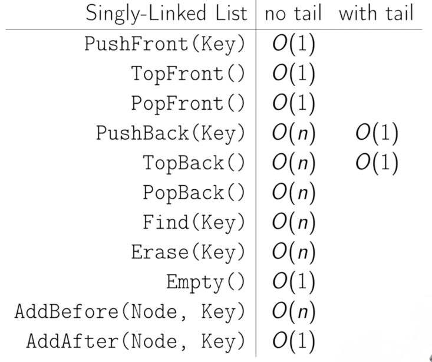
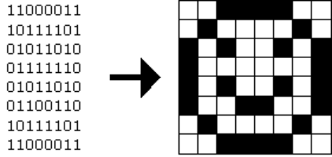

<script type="text/javascript" src="http://cdn.mathjax.org/mathjax/latest/MathJax.js?config=TeX-AMS-MML_HTMLorMML"></script>
Introduction to Computer Science
---  
Note-taker: [Baksi](https://github.com/BaksiLi)  

# Content

- [Preface](#preface)  
- [Main](#main)    
	1. [Computing](#i-computing) ... <sub>*NoA*, *Computer Systems*</sub>
		1. A few questions
		1. Notion of Abstraction
		1. Addressing Computational Problems
	1. [Programming](#iii-programming) ... <sub>*C*, *Programming Paradigms*</sub>
		1. Preparations
		1. Programming Languages
		1. C Language
	1. [Information](#ii-data) ... <sub>*Information and Knowledge*, *Code*, *Data types*, *Algorithm*, *Complexity*</sub>
		1. Information and Knowledge
		1. Algorithm and Complexity
		1. Bits and Integers
	1. [Data Structures](w5) ... <sub> *Array*, *Linked Lists*, *Pointer*</sub>
 		1. Arrays and Linked Lists
		1. Dynamic Arrays and Amortised Analysis
		1. Priority Queues and Disjoint Sets
		1. Hashing
		1. Binary Search Trees
	1. [Algorithms](#iv-algorithms)
		1. Basic Search Algorithms
		1. Basic Sort Algorithms
		1. Others <!-- Light-ups -->
	1. [Web and Internet](w6)
	1. [Advance Features of Python]()
- [Future Study](#future)

---
# Preface
This is a short but tangible introduction of Computer Science, originally the note of CS50x 2017 of Harvard University, lectured by <a mailto="malan@havard.edu">David J. Malan</a>.
The content and structure is now largely different from the [CS50x syllables](http://docs.cs50.net/2017/x/syllabus.html) since it has been restructured and modified with new materials, according to my own taste (as a theorist). Meanwhile, parts which teach how to code were reduced for the sake of simplicity. Nevertheless, all the knowledge are covered and extended beyond their scope.   
The original course video and other supporting materials could be found in the [seminar page](http://cs50.tv/2017/fall/#about,lectures), or in their channel [cs50 live](https://www.youtube.com/user/cs50tv/). It will also be helpful to check out the literature mentioned in the context.   
<center><b>Have a nice journey!</b></center>

<details>
<summary>Relavant Readings</summary>

- *How Computers Work*, Tenth Edition
Ron White
Que Publishing, 2014
ISBN 0-7897-4984-X
- *Code: The Hidden Language of Computer Hardware and Software*, First Edition
Charles Petzold
Microsoft Press, 2000
ISBN 0-735-61131-9
- *Programming in C*, Fourth Edition
Stephen G. Kochan
Pearson Education, 2015
ISBN 0-321-77641-0
- *Hacker’s Delight*, Second Edition
Henry S. Warren Jr.
Pearson Education, 2013
ISBN 0-321-84268-5
</details>

# Main
## I. Computing
<!-- This chapter is modified according to Subrata Dasgupta's *Computer Science* -->
### A few questions
#### What is a computer and what can it do?
- **Computers** are information processing automata; they are dumb machines (*Electronic idiots*) in the sense that they do *only* what user instructed, but at the same time very clever if the people behind are intelligent.... {Discuss!}
- We will come back to its formal definition later after we discussed what is mean by computing.

#### What is Computer Science about?
- Computational artefacts are *made*  things which entail the purpose of their creators. **Computer science** is the science of such artefacts.
- Therefore often material computational artefacts, or computer hardwares, belong to the domain of engineering schools, while liminal and abstract ones are in the domain of school of science.

### Notion of Abstraction
- When we were taught about electric circuit, as the circuits get more and more complicated, often teachers would tell us to see some parts of them as *black boxes*. And when these black boxes are operating, unless problems occurred they could stay in this harmony for the rest of their life. They are given individual names, as the relay unit, the automatic tripping unit and so on. This process is called *abstraction*.
- Levels of Transformation:   
	- Computational problems > Algorithms > Language > Machine (ISA) Architecture > Microarchitecture > Circuits > Devices.   
	(see Yale N. Patt and Sanjay J. Patel, Introduction to Computing Systems: From Bits and Gates to C and Beyond.).

### Addressing a Computational Problem
- To address a computational problem:
	- **Formulation**:  Express the problem formally,
	- **Specification**: Find the *algorithm* to deploy,
	- **Implementation**: Programming (in a programming language).

- Underneath the hood: A computer program is the specification of a desired computation in a language understandable to computers. To achieve this, the program is translated into **ISA** (Instruction Set Architecture), and to **microarchitecture**, **circuits** and eventually **electrical components**. We do not bother too much about these in this module.
- What is the difference between a program that does mathematical operations and the actual maths? A program however, when designing it, there are constraints which applied by virtue of the machine... (ergo non-distinction of soft- and hard-wares)

### RAM

### Homework 1
- Try *Scratch*
 [Scratch](www.scratch.mit.edu) is a visual toolkit for amateurs to learn and grab an idea of *programming*. 

## II. Programming
<!-- Originally week 1 -->
### Preparation
#### CS50x IDE (for students)
- Environment: Cloud [IDE](https://ide.cs50.io/) platform, [CS50.h Reference](https://reference.cs50.net/math/modf). The library is available at GitHub, *cf.* [libcs50](https://github.com/cs50/libcs50).
- Debugging in IDE: `eprintf`, ` help50` and `debug50`.

#### In situ (for general readers)
- Terminal: learn elementary *BASH* instructions.
- Editors (optional): [Vim](https://en.wikipedia.org/wiki/Vim_(text_editor) or [Eclipse](https://en.wikipedia.org/wiki/Eclipse_(software)) for Hardcore players. The presenter uses [Atom](https://atom.io/).
- IDEs are good and easy to install. 
	- C: MacOS users can (sometimes must) install [Xcode](https://developer.apple.com/xcode/); for cross-platform [Visual Studio Code](https://code.visualstudio.com/).
	- Python: [Anaconda](https://www.anaconda.com/distribution/) (with its Spyder) is the default choice for data scientists, while [PyCharm](https://www.jetbrains.com/pycharm/) is more compatible with other uses. However, in early 2019 Anaconda and JetBrains announced that they will [join forces to launch 'PyCharm for Anaconda'](https://www.businesswire.com/news/home/20190404005205/en/Anaconda-JetBrains-Join-Forces-Launch-%E2%80%98PyCharm-Anaconda%E2%80%99), so no more troubles in the future.

### Programming Languages
- A computer **program** is a collection of instructions to achieve specific tasks. It is a liminal artefact, since instructions are abstract but the operations are done in the physical world. **Binaries** corresponded directly to specific instructions. 
- **Assembly Languages** enabled the programmers to use symbolics instead of binaries, released them from clerical workload, a symbolic assembler is used in such translations. It is just symbol-to-operation therefore low-level and not portable. Low-level languages are tied to the computer on which the programs will execute.
- **High-level Languages** are designed, to abstract from features of the actual physical machines, among them *FORTRAN* (FORmula TRANslation Language) is the first.
	- A good short-piece discussion of programming languages, see [Blue. No! Yellow!](https://blog.cleancoder.com/uncle-bob/2016/05/21/BlueNoYellow.html).
- **Compilers** translate statements into sequence of machine codes (ISAs) that can be directly executed. The translation from the unique assembly language of a computer to its ISA is done by an assembler.

### C Language
- https://www.youtube.com/watch?v=ci1PJexnfNE&ab_channel=Computerphile
- *C* language was designed for manipulation of low-level hardware structures.
- Good coding style is important. [CS50 style guide of C](https://manual.cs50.net/style) and [Popular Coding Convention on Github](http://sideeffect.kr/popularconvention).


### Homework 2

#### [Problem set #1](https://docs.cs50.net/2017/x/psets/1/pset1.html)
- Hello World  
- Functions  
- IO & Loop  
#### [Problem set #2](https://docs.cs50.net/2017/x/psets/2/pset2.html)
- Caesar Cipher
- Vigenere Cipher
- [Crack Cytology question](https://docs.cs50.net/problems/crack/crack.html)


## III. Information
<!-- Originally week 3 -->
### Data and Information
- What is Information? Datum
- Computer is a system organised with levels of transformation.
- Information holder, processor {?}.
- Unit called bit is the element. A modern digital computer use **binary** code, so the length of the code $k$ (how many bits it has) corresponds to a code of size $2^k$ (how many possible values).
	- More about code and coding could be found in the note *Coding Theory* (currently not available).

### Algorithm and Complexity
> A programmer designs algorithms, intended for mechanical execution, intended to control existing or conceivable computer equipment.   
Dijkstra, Edsger W. (1974), 'Programming as a Discipline of Mathematical Nature', *American Mathematical Monthly*, 81(6): 608–612. Available [here](http://www.cs.utexas.edu/~EWD/transcriptions/EWD03xx/EWD361.html).

#### Algorithm?
- An **Algorithm** is an abstract artefacts of the method for solving problems, which embodies non-declarative procedure or *procedural knowledge* (objective knowledge as Karl Popper called).
	- In chemistry, litmus test is a decision procedure which decides the acidity (or alkalinity) of substance, *if* blue *then* alkaline; *if* red, acid; *otherwise* it is neutral. Examples in maths: long division algorithm for factorization.
	- "In computing practice the algorithm denotes the expression on paper of the proposed computational process (often by means of a flowchart) prior to the preparation of the program. If no algorithms is possible a heuristic solution has to be sought {in which it involves trial and error, as in iteration.}."
	- In such procedure, the experimenter does not necessarily need to know why it works:- the execution is mindless thinking. It is comforting that the performance of an algorithm is not dependent of the performer.
- More generally, as enunciated by Donald Knuth, in order to procedure the following attributes must be satisfied:
	1. Finiteness: An algorithm always terminates after a finite number of steps (or satisfied a certain termination criterion).
	1. Definiteness: Every step of an algorithm must be precisely and unambiguously specified.
		- In this sense, cookbook recipe is usually not algorithms, as it may include instructions like 'cook slowly' or 'moderately' which rely on the performer's judgement to interpret.
	1. Effectiveness: Each operation performed as part of an algorithm must be primitive enough for a human being to perform it exactly (using a pencil and paper).
	1. Input and Output: An algorithm must have one or more inputs and one or more outputs.

#### Computational Complexity
- An algorithm cannot be measured in *physical* time since it is abstract , and an algorithm qua algorithm involves no material thing. Instead, people assume that each basic step of the algorithm takes the same amount of time, a.k.a. *abstract* time.
- In terms of the growth rate (# of operations against input size $n$), functions are roughly ordered:
> Logarithmic $log(n)$, Linear $an + b$, Quadratic $an^2 + bn + c$, Polynomial $an^z + \dots + an^1 + an^0\text{ with constant }z$, Exponential $a^n\text{ with constant }a$, Factorial $n!$

- **Asymptotic complexity** (introduced by German Mathematician P. Bachmann in 1892) provides a way to specify the efficiency of an algorithm as a function of the problems size $n$. 
	- $O$, a.k.a. asymptotic upper bound -> worst-case scenario.
	- $\Omega$, a.k.a. asymptotic lower bound -> best-case scenario.
	- $\Theta$ notes when $\Omega = O$, known as the asymptotically tight bound.
- Constants and low-order terms are dropped, which means two algorithms may have the same $O$ even though one is always faster than the other. Ordered:
> $log(n)\leq n\leq n^2\leq n^z\leq a^n\approx n!$


### Bits and Integers
- **Data types** define what data objects could hold along with the operations that are permissible on such values.  
	- It could be either *primitive* or *structured* (composite of primitives).
- **Unsigned Integers** represented as strings of binary digits. Take $2^k$ distinct patterns of k bits and separate them in half – half for positive numbers and half for negative numbers – we will end up with **Signed Integers**. Allocations of such code to decimal values in different conventions resulted in different representations, among which the *2's Complement* is the one used on every computer today (proof in *Homework 2*).
- ALU

### Homework 3
- Binary-decimal conversion:
	- 11000111 to a decimal integer value.
	- +105

- What is the range of signed integers held by 16 bits?
	> $2^{16}/2$
	
- Use ALU and the following table, prove that 2's complement data type is better than the other two since it keep the calculation as simple as possible. <!-- Table of sample code, length 5 binary-->

## IV. Data Structures
### Array
- An **array** (or linear list) is a contiguous area of memory consisting of equal-size elements indexed by contiguous integers. It is immutable, meaning that once created cannot be changed.

- It turns out that underneath the hood, strings are a little more mundane - **grid of information** (buckets). Lee takes those contiguous blocks of memory "- L - e - e - \0 -" in RAM.  (`int main(int argc, string argv[])`)

- Constant-time access to read and write. 
	- Getting the address: $array\_addr + elem\_size \times (i - first\_index)$.

- Constant-time to add/remove at the end, and linear time to add/remove at an arbitrary location.

|:-:|:-:|:-:|
|Beginning|$O(n)$|$O(n)$|
|End|$O(1)$|$O(1)$|
|Middle|$O(n)$|$O(n)$|

### Linked Lists
Data structure allows more flexible running, memory are allocated dynamically, rather than using remalloc(), free() and so frequently.

#### Node
- **Node** contains a key and a next *pointer*.

|:-:|
|n|
|*next|  

<details>
<summary>*ut idem pro (C)*</summary>

```C
typedef struct node{
	int n; 
	struct node *next;
} 
node; 
```
</details>

#### (Singly) Linked Lists
- Nodes are chained together, forms a **collection of nodes** that are linked together by pointers. 

- The starting pointer and the ending nil. In order to achieve the function of *insert*, *remove* and *search*.   

- Operations
	- *Boolean Empty()*, empty list?
	- *PushX(Key)*, add to X; *Key TopX()*, return X item; *PopX()*, remove X item. X be location Front and Back.
		- *PushFront(Key)*: firstly create a node with *Key* and update the next pointer, then update the head pointer to point the new node. Therefore $O(1)$. 
			<details>
			<summary>*ut idem pro (psudo)*</summary>
			
			```
			PushFront(key):
				node <- new node
				node.key <- key
				node.next <- head
				head <- node
				if tail = nil:
					tail <- head
			```
			</details>
		
		- *Key TopFront()*: look up the first element and return. Therefore $O(1)$.
		- *PopFront()*: update head pointer, remove the node. Therefore $O(1)$.
			<details>
			<summary>*ut idem pro (psudo)*</summary>
			
			```
			PopFront():
				if head = nil:
					ERROR: empty list
				head <- head.next
				if head = nil:
					tail <- nil
			```
			</details>
			
		- *PushBack(Key)* without a tail: need to go one by one and do Push. Therefore $O(n)$.
		- *PushBack(Key)* with a tail: $O(1)$
			<details>
			<summary>*ut idem pro (psudo)*</summary>
			
			```
			PushBack(key):
				node <- new node
				node.key <- key
				node.next = nil
				if tail = nil:
					head <- tail <- node
				else:
					tail.next <- node
					tail <- node
			```
			</details>
			
		- *Key TopBack()*.
		- *PopBack()*:
			<details>
			<summary>*ut idem pro (psudo)*</summary>
			
			```
			PopBack():
				if head = nil:
					ERROR: empty list
				if head = tail:
					head <- tail <- nil
				else:
					p <- head
					while p.next.next ≠ nil:
						p <- p.next
					p.next <- nil
					tail <- p
			```
			</details>
		

	- *Bolean Find(Key)*, is key in list? The running time of search would always be O(n) since the only way of searching is just linear.

		<details>
		<summary>*ut idem pro (C)*</summary>
		
		```C
		bool search(int n, node *list){
			node *ptr = list;
			while (ptr != NULL){
			// access n inside node addressed by ptr
				if (ptr->n == n){
					return true;
				}
				ptr = ptr->next;
			}
			return false;
		}
		```
		
		</details>
	
	- *Erase(key)*, remove key from list, *AddBefore(Node, Key)* and *AddAfter(Node, Key)*, add key before/after node.
	- Summary
	
	
Same "incantation of strings" are different, in the sense of memory. Why?
Notice that if you run a program in terminal, your computer would give that program the illusion of a really big chunk of memory all on its own. When main is called, main is given a stack space.	... [sloppily drawn]  
A string is technically just the address of a character in memory (the first byte of your 'string' array, ends with '\0').   Therefore when two individually defined strings are compared, they are different since their address are different. It is just an address, AKA a **pointer**.  
A string is a synonym for a data type called `char *`, `strcmp()` can compare two strings from their pointers. 

[//]: # "He who wonderfully sat down with me at  office hours one day in the dining hall, trying to help me understand pointers because it was just so much more technical than the other stuffs. This is among those topics that might take a little bit of time to sink in, but it does. and when it does, it really is that proverbial light bulb that goes off. and for me that light bulb went off right then and there."
`malloc()` tells computer to give a block of memory of sizeof(xx), and return it to main().  
1. Pointer arithmetic  
syntatic sugar `s[i]` is just `*(s+i)`   
[output is atrocious, pretty verbose] `valgrind` to check **memory leak**. `free()` .  stack overflow/ heap overflow/ buffer overflow.  

|:-:|:-:|:-:|
 | Array | Linked list
Read | O(1) | O(n)
Insert |  O(n) | O(1)
Remove | O(n) | O(1)

#### Doubly-Linked Lists
See [Appendix](/IntroToCSAppendix.md) 1.

### More	
	- **Stack** type: Push and Pop (?LIFO data structure)  

	```C
	typedef struct stack{
		int *numbers;  // numbers[CAPACITY]
		int size;
	}
	stack;
	```
	
	- **Queue** type: enqueue and dequeue   

	```C
	typedef struct queue{
		int front;
		int *numbers;  // numbers[CAPACITY]
		int size;
	}
	queue;
	```
	
	- **Tree** type: <!--58:00-->

	*Binary search tree*, left smaller right greater. *aut idem pro*:  
		
	```C
	typedef struc node{
	int n;
	struct node *left;
		struct node *right;
	}
	node;
	```
	therefore searching function:
	```C
	bool search(int n, node *tree){
		if (tree == NULL)
		{
			return false;
		}
		else if (n < tree->n)
		{
			return search(n, tree->left);
		}
		else if (n > tree->n)
		{
			return search(n, tree->right);
		}
		else
		{
			return true;
		}
	}
	```
	but for the case of text, this is not that practical -> **Huffman coding**.
	
	Compression certainly has a lower limit, relevant to *information entropy*.  
	
	```C
	typedef struc node
	{
		char symbol;
		float frequency;
		struct node *left;
		struct node *right;
	}
	node;
	```
	
	- **Hash tables**: Linear probing, or dynamically extended linked lists.  
	- **Trie** type, widely used as spelling checker model (dictionary!).  
	- **Min Heap** used in Graph Algorithms.

1. file structures
	- Picture:
		- BMP(Bit map): see [Bitmaps & Palette Manipulation](http://www.brackeen.com/vga/bitmaps.html).
		
		hex editor: ` xxd -c 24 -g 3 -s 54 smiley.bmp `. `-s 54` stead for starting from address 00000036 which is 54 in hexadecimal since 14 + 40 = 54 lines (bytes) the metadata of a 24-bit BMP has. Further descriptions -> [this](https://docs.cs50.net/problems/whodunit/whodunit.html#background)  
		In c there is *struct* can be defined.  RGB colour.
		- JPEG image:  

Incidentally, HTML and CSS (languages in which webpages can be written) model colours in this same way. If curious, see http://en.wikipedia.org/wiki/Web_colors for more details.
	- CSV (Comma separated)

### Problems
1. [Problem set #4](https://docs.cs50.net/2017/x/psets/4/pset4.html): Forensics  
	- [Whodunit](https://docs.cs50.net/problems/whodunit/whodunit.html#background): restore a forensic image by switching certain pixels into other colours. To be familiar with the structure of 24-bit uncompressed BMPs.  
	- Resize  NTBC;  
	- [Recover](https://docs.cs50.net/problems/recover/recover.html)  

1. [Problem set #5](https://docs.cs50.net/2017/x/psets/5/pset5.html): Misspellings  
<input type="checkbox" name="pset3" checked="True"> Status <br/>
	- [Speller](https://docs.cs50.net/problems/speller/speller.html): `submit50 cs50/2017/x/speller`  
	- Understand [C compiler](https://docs.cs50.net/problems/speller/speller.html#code-makefile-code)
	- the [form](https://forms.cs50.net/2017/x/psets/5)   

## IV. Algorithms
### Search Algorithms
- *Linear Search*, i.e. if asking to guess a number in the range of 100, then $O(n)$.  
- *BinarySearch* or Divide & Conquer, for a sorted list, for each step the middle entry is identified and compared to the target, $O(\log_2 n)$.  

<details>

```python
def binary_search(list, n):	
	low = 0
	high = len(list) - 1
	while low <= high:
		mid = (low + high) / 2
		guess = list[mid]
		if guess == n:
			return mid
		if guess > n:
			high = mid - 1
		else:
			high  = mod + 1
	return None
```

</details>

### Sort Algorithms
1. **Counting sort**: Time Complexity: O(n+k) where n is the number of elements in input array and k is the range of input.
1. **Selection sort** gets slower&slower through time because the whole list is scanned every time.  $\Omega(n^2)$ ok 
 `for i from 0 from n-1: find smallest between i'th and n-1'th: swap smallest with i'th ` 

<details>

 ```python
 def findsmallest(arr):
 	smallest = arr[0]
 	smallest_index = 0
 	for i in range(1, range(arr)):
 		if arr[i] < smallest:
 			smallest = arr[i]
 			smallest_index = i
 	return smallest_index
 	
 def selection_sort(arr):
 	arr_new = []
 	for i in range(len(arr)):
 		smallest = findsmaillest(arr)
 		arr_new.append(arr.pop(smallest))
 	return arr_new
 ```

</details>

1. **Bubble sort** that swap only consecutive pair-wises every time.
 `repeat until no swaps: for i from 0 to n-2: if i-th and i + 1-th elements out of order: swap them`  
Upper boundary $(n-1) + (n-2) + ... + 1 \\ = \frac{n(n-1)}{2} = O(n^2)$  ; Lower boundary $\Omega$ = n
1.  **Insertion sort**(Counting sort)
`for i from 1 to n-1: call 0-th throgh i - 1-th elements the sorted side: remove i-th element: insert into sorted side in order `  
1. **Merge sort**
`On input of n elements: if n<2: return; else: sort left half of elements; sort right half of elements; merge sorted halves `  → $T(n) = T(\frac{n}{2}) + T(\frac{n}{2}) + O(n) \\ \stackrel{\text{if n \geq 2}}{=} O(nlogn)$  

<details>

```C
int sigma(int m){
	int sum = 0;
	for(int i = 1; i <= n; i++){
		sum += i;
	}
 }
```
 *aut pro*:  
 ```C
 int sigma(int m){
 	if(m <= 0){
 		return 0;
 	}else{
 		return (m + sigma(m - 1));
 	}
 }
 ```
 in a **Reflexive** or **inductive** or **recursive** calls (use the definition again & again) fashion.

 </details>
	 
### [Problem set #3](https://docs.cs50.net/2017/x/psets/3/pset3.html)  
- Find, either less or more comfortable: (latter one is chosen)
	- how to **configure a compiler**
	- how to **write program in multiple files**
- Implement Game of Fifteen  

- Further in algorithm and computational complexity theory, cf. *Graph Theory and Algorithms (with Python)* note.

- Recall that in *Homework 2*, we've done conversions between decimals and binaries. Summarise the process in a step-by-step fashion.
- Implement the process in C.

## IIX. Web and Internet [w6]
<!-- Originally week 6 -->
[//]: # "Waited to be reviewed after referred to a book."
1. Internet models. 
	- A central **protocol** is used to assign certain settings to all the devices, so called **router**. It is a typical example, and a special type of software called **DHCP** (Dynamic Host Configuration Protocol). 
	- At the first time a device is connected, a unique identifier, is given to it. **IP address**, **Ether & Inet**.  
	- **DNS** helps the conversion between numerical address into more human-friendly host names, or fully qualified domain names (& thankfully no more mnemonics). Look up server address by cmd `nslookup xxxx`.  
	- **Routers** globally system. Trace the route one query at a time to somewhere. `traceroute -q 1 xxxx`. 
	- **Packet** leverage a feature of IP and its sister protocol(s) **TCP**(and others like **UDP** that often used for live streaming). The former fragment the info, and the TCP associates and guarantee fragments.  
	- **Port** number.  
	- **Firewall** and **VPN**.  
		- curl ifconfig.me, open a specific port: sudo pfctl -vnf /etc/pf.conf
		- show who is using lsof -i:8000 [open port](http://blog.csdn.net/human8848/article/details/52268337)
	- To conclude: xx  

1. **HTTP**(Hyper Text Transmitting Protocol): "Handshake agreement", contents are written in **HTML**(Hyper Text Markup Language). <!-- Succint -->  
	- **Status code**(Table).
	- `telnet sss.harvard.edu 80`. N.B. telnet and ftp are no longer available due to some "insecure" reason (or due to 32bit) on macOS 10.13, so nc, ssh and stfp is used instead. `curl -I ` just for header.  
1. **CSS**  

### Other programming paradigms
- Declarative, logic programming

[//]: # "Week 7: Machine Learning. This section is removed to another note, acting as an introduction."

## IX. Python Language [w8] 
<!-- Originally week 8 Python-->
<!-- Move to II? Nope, but need to remove those Python codes in IV -->
### Python
- Recursion in Python: functions can call themselves. For example:

	<details>

	``` python
	def factorial(n):
		if  n == 1:  # base case
			return 1
		return n * factorial(n - 1)
	```
	
	</details>
cf. [Recursion Factorial](https://www.cs.usfca.edu/~galles/visualization/RecFact.html) visualization.
- Object-Oriented Programming features in Python: paradigm based on object. For example:
	<details>

	```python
	class Coordinates:
		def __init__(self, x, y):
			self.x = x
			self.y = y
		
		def shift(self, x, y):
			self.x += x
			self.y += y
			
	p = Coordinates(1, 2)
	p.shift(1, 1)
	print('x = {}, y = {}'.format(p.x, p.y))
	```

	</details>

1. The meaning of object type, value, and identity. Depending on the type of the object, it could be either immutable (*e.g.*, strings and tuples) or mutable (*e.g.*, dictionaries and lists). Methods are functions associated with objects, whereas data attributes are data associated with objects.   
	Polymorphism to operators   
	Typing or assigning data types feres to the set of rules that the language uses to ensure that the part of the program receiving the data knows how to correctly interpret that data. Some languages are **statically typed**, like C/C++; whilst other languages are **dynamically typed**, like Python. Static typing means that type checking is performed during compile time, whereas dynamic typing means that type checking is performed at run time. 
	Therefore for an immutable object, like an int, Python creates a new object when operation is done; otherwise for a mutable object, it changes only the value at the address.   
	
	```
	>>> N1 = 3
	>>> N2 = N1
	>>> N2 += 1
	>>> N1
	3
	>>> N2
	4
	```
	but for a mutable list:   

	``` 
	>>> L1 = [19, 2, 3]
	>>> L2 = L1  # A.K.A **Shallow copy**
	>>> L2[0] = 3
	>>> L1
	[3, 2, 3]
	>>> L2
	[3, 2, 3]
	>>> L1 == L2
	True
	>>> L1 is L2
	True
	>>> L3 = list(L1)  # or L3 = L1[:], A.K.A **Deep copy**
	>>> L3
	[3, 2, 3]
	>>> L3 == L1
	True
	>>> L3 is L1
	False
	```
	More features of Python, see [xx]().
	
2. Web App with Python. 
	
	using http.server module b;
### [Problem set #6](https://docs.cs50.net/2017/x/psets/6/pset6.html): Sentimental
	Flask, Twitter application, Analyzer


<!-- Operating System? -->
<!-- SQL and JavaScript parts are removed -->

---
# Further Study [future]
- 【Updated 2019】[CS50 Beyond](https://cs50.harvard.edu/beyond/2019/winter/lectures/) is a 6-days lecture series that provides a continuation of CS50 in Web Development.
- Further in Languages
	- Learn [C language@cppreference.com](http://en.cppreference.com/w/c/language)
	- Maybe learn the 'better C' *C++*?
- Specified path
	- Data Science: [6.00.2x: Introduction to Computational Thinking and Data Science](https://www.edx.org/course/introduction-computational-thinking-data-mitx-6-00-2x-6) (which is considered as the continuous course of 6.00.1x, equivalent to cs50x)
	- Web: [CS50's Web Programming with Python and JavaScript](https://www.edx.org/course/cs50s-web-programming-with-python-and-javascript)
	- Game Development: [CS50's Introduction to Game Development](https://www.edx.org/course/cs50s-introduction-to-game-development)
	- Mobile Apps: [CS50's Mobile App Development with React Native](https://www.edx.org/course/cs50s-mobile-app-development-with-react-native)

- More Courses
	- [Life after CS50!](https://cs50.stackexchange.com/questions/2890/life-after-cs50)
	- [Self study for Stanford's MSCS Foundation courses](https://backdoorgraduteschooladmissions.quora.com/Self-study-for-Stanfords-MSCS-Foundation-courses?share=1&srid=n9RZ), esp. CS107 - [Programming Paradigms](https://see.stanford.edu/Course/CS107) by Stanford
- ET CETERA
