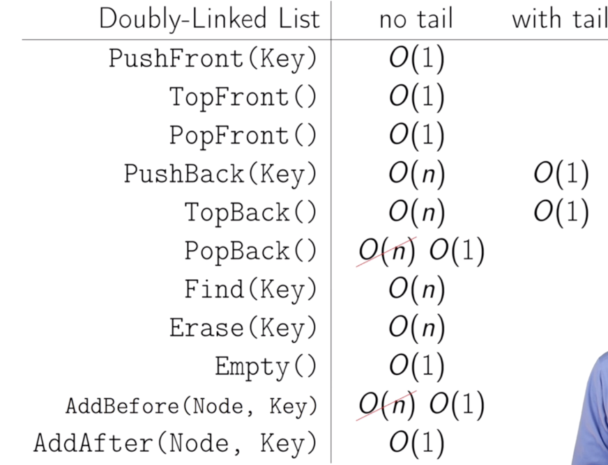

IntroToCS Appendix
---
# Chapter IV Data Structures
## 1. (Doubly) Linked List
- Each node contains two pointers, a forward and a backward, which allow us to make operation cheaper computationally. 
- Operations (selected)
  - *PushBack(key)* is now O(1).
      <details>
      <summary>*ut idem pro (psudo)*</summary>
      
      ```
      PushBack(key):
        node <- new node
        node.key <- key
        node.next = nil
        if tail = nil:
          head <- tail <- node
          node.prev <- nil
        else:
          tail.next <- node
          node.prev <- tail
          tail <- node
      ```
      </details>
      
  - *PopBack()*
    <details>
    <summary>*ut idem pro (psudo)*</summary>
    
    ```
    PopBack():
      if head = nil:
        ERROR: empty list
      if head = tail:
        head <- tail <- nil
      else:
          tail <- tail.prev
          tail.next <- nil
    ```
    </details>

  - *AddAfter(node, key)*
    <details>
    <summary>*ut idem pro (psudo)*</summary>
    
    ```
    AddAfter(node, key):
      node2 <- new node
      node2.key <- key
      node2.next <- node.next
      node2.prev <- node
      node.next <- node2
      if node2.next ≠ nil:
        node2.next.prev <- node2
      if tail = node:
        tail <- node2
    ```
    </details>

  - *AddBefore(node, key)*
    <details>
    <summary>*ut idem pro (psudo)*</summary>
    
    ```
    AddBefore(node, key):
      node2 <- new node
      node2.key <- key
      node2.next <- node
      node2.prev <- node.prev
      node.next <- node2
      if node2.prev ≠ nil:
        node2.prev.next <- node2
      if head = node:
        head <- node2
    ```
    </details>
  
- Summary



  

